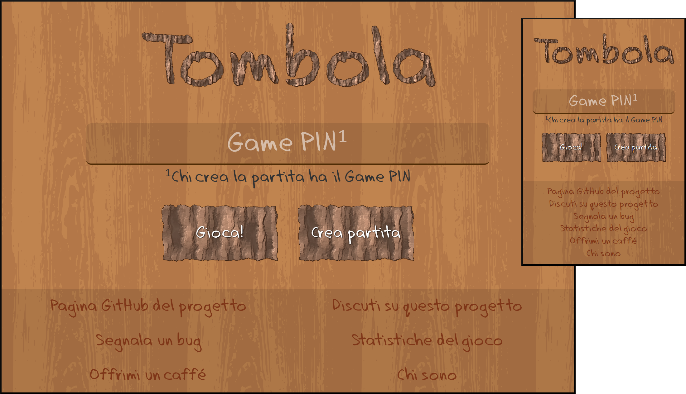

# Tombola 
Il classico gioco natalizio online.

## Indice dei contenuti
  - [Come si gioca](#come-si-gioca)
  - [Contribuire](#contribuire)
  - [Server disponibili](#server-disponibili)
    - [Creare un nuovo server](#creare-un-nuovo-server)
  - [Come funziona](#come-funziona)
    - [Pagine](#pagine)
      - [Amministrazione](#amministrazione)
    - [Database](#database)

## Come si gioca
Questo gioco è pensato per essere giocato in compagnia di amici, parenti, ma anche compagni di banco o colleghi; non ha bisogno di registrazione.
* Una persona (_tombolone_, _tombolaro_ o _croupier_) si occupa di creare una nuova partita, ottenendo dal server un codice pin;
* Gli altri inseriranno quel codice pin dalla pagina principale e potranno scegliere sul momento un nome (unico per partita) e una cartella;
* La pagina del tombolone, pensata per essere proiettata su grande schermo (o comunque visibile a tutti) si aggiorna automaticamente con l'elenco dei partecipanti;
* Quando tutti i partecipanti (a discrezione del tombolone) si sono uniti alla partita, il gioco può iniziare.

## Contribuire
Chiunque può contribuire a questo progetto, in diversi modi:
* Traducendo il progetto in altre lingue;
* Scovando e segnalando/risolvendo [bug](https://github.com/padvincenzo/tombola/issues);
* Suggerendo nuove idee;
* Implementando nuove funzionalità.

Per qualunque dubbio o perplessità possiamo discuterne sulla [pagina apposita](https://github.com/padvincenzo/tombola/discussions)

## Server disponibili
[Gioca sul mio server](https://vincenzopadula.altervista.org/tombola/)

_nessun altro server per ora_

### Creare un nuovo server
Se vuoi installare la tombola sul tuo server, devi:
1.  Scaricare tutti i file sul tuo server;
2.  Aggiornare il file ``connect.php`` con le credenziali del tuo database e scegliere una password di amministratore;
3.  Aprire il sito alla pagina ``install.php`` per creare e inizializzare il database.
4.  Sei incoraggiato ad apportare modifiche e implementare nuove funzioni (nel rispetto della [licenza](https://github.com/padvincenzo/tombola/blob/main/LICENSE))
5.  Menziona la [pagina principale del progetto](https://github.com/padvincenzo/tombola) e, se vuoi, puoi proporre il tuo server, che aggiungerò alla tabella dei server disponibili.

## Come funziona

### Pagine

#### Amministrazione
* ``install.php`` crea il database e si autoelimina;
* ``reset.php`` effettua un reset del database.

### Database

